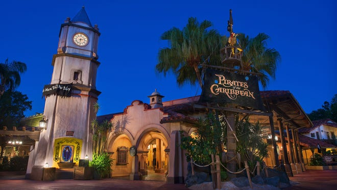

# Predicting Disney World Wait Times
 


### Contents:

* [Problem Statement](#Problem-Statement)  
* [Background](#Background)
* [Data](#Data)  
 * [EDA and Data Cleaning](#EDA-and-Data-Cleaning) 
 * [Data Dictionary](#Data-Dictionary)
* [Modeling](#Modeling)  
 * [FB Prophet](#FB-Prophet) 
* [Results/Conclusion](#Results/Conclusion)
* [Issues](#Issues)  
* [Future Improvements](#Future-Improvements)  
* [References](#References)

## Problem Statement
---
Going to a Disney theme park is one of the most quintessential vacation experiences for travelers from all around the world. Though most enjoy their time vacationing in the parks, there are aspects of the parks that many do not find enjoyable.  Disney World in Florida is home to 4 of the top 10 attended theme parks in the world.  With that honor or accolade, comes the bane of many Disney World attendees - long wait times.  With the available wait time data from TouringPlans.com, I will use machine learning models to predict the wait times for selected Disney World rides.  I will build a regression model to predict the hourly wait time for a specific Disney World ride. Model performance will be guided by lowest RMSE.  With this information, guests at Disney World can reduce the amount of time they wait in line and can use this extra time to have a more magical experience on their Disney vacation.

## Background
---
The Walt Disney Company owns and operates the Walt Disney World resort in Florida.  Disney World is a huge resort area, encompassing close to 40 square miles in central Florida, just outside the city of Orlando. The resort was founded by Walt Disney in October of 1971 and opened with one theme park, the Magic Kingdom, and one on site hotel.  Since then, the resort has grown to consist of four theme parks, 2 water parks, a large shopping district, 4 golf courses, the ESPN sports complex, and 28 Disney owned hotels.   The 4 theme parks combined have 51 rides or attractions and countless experiences to entertain their guests.  

Though there are many rides in the 4 theme parks,  the The Global Attractions Attendance Report from TEA/AECOM 2018 Theme Index estimates that over 58 million guests attended the parks in 2018, the last year attendance figures have been released.  With millions of guests visiting each park, most guests spend many hours of their day waiting in long lines.  


## Data
---

An incredible data set for Disney World wait time data has been made available from TouringPlans.com.  This data set includes wait times for 14 Disney World attractions that goes back as far as 2012 on some rides as well as accompanying descriptive information on each day of operation.  Ideally, data from the Disney company would be the best possible source for this project, but Disney does not release wait time data for their theme parks.  

Founded in 2012 by Len Testa, TouringPlans.com is a company offers customized plans to reduce your wait times in Disney World.  The company offers a subscription based plan that uses historical wait time data to plan the best time to visit the rides and creates a custom plan or schedule for your day according to the rides and attractions you indicate you want to visit.  They use wait time data from Disney World's apps as well as wait times their users enter for the times they experienced in the parks. The wait time data they released is a combination of that data for 14 of the most popular rides of the 4 Disney World theme parks.


```
|__ Rides
|   |__Seven Dwarfs Mine Train
|   |__Alien Swirling Saucers
|   |__Dinosaur
|   |__Expedition Everest
|   |__Flight of Passage
|   |__Kilimanjaro Safaris
|   |__Navi River Journey
|   |__Pirates of the Carribean
|   |__Rock 'n' Roller Coaster
|   |__Slinky Dog Dash
|   |__Soarin
|   |__Spaceship Earth
|   |__Splash Mountain
|   |__Toy Story Mania
```
TouringPlans.com also included a 'metadata' csv file that included 190 observations about the Disney World resort on for each day of operation.  These range from time of park opening and closing, percent of geographic school areas in session, special events, type of holiday season to the average temperature for the day. This data was accompanied by a detained data dictionary which I am including with this project. 


### EDA and Data Cleaning
---
The data started as 14 csv files that contained over a hundred thousand time observations each and a wait times for each of the rides.  I created a series of notebooks, that imported the files, cleaned the date, formatted the data types, and averaged the observations for each hour before saving the data back to new csv files named for their respective rides.  I then created a notebook that imported the metadata file and separated the observations or columns into 4 separate csv files that represented a different theme park.  Each theme park csv was also given a set of columns that related to all of the theme parks.

### Data Dictionary

The data dictionary is provided by TouringPlans.com and is very comprehensive.  It is in an excel format, so it will not open in Github.


[Link to the Data Dictionary](./touringplans_data_dictionary.xlsx)


## Modeling
---

I selected many different regression models for use on this data set.  Pirates of the Caribbean was the ride that I initially tested all of my models and thus I will use it as an example for my analysis.  Though I am only listing the results for the Pirates of the Caribbean ride here, there is a separate notebook for each of the 14 rides with different values for their different models.  I measured the models on the basis of RMSE and some of the rides performed better and some worse overall than those of Pirates of the Caribbean.



I set up 8 of the 9 models that I used with the same initial code and features. Each column named for a ride is populated with the wait times for that ride. I used the name of the ride, in this case Pirates of the Caribbean, as the y variable.  The X variable was set to a list called 'features' that contains all relevant columns or features that I am using in the model.  For theses models, I am only using 12 of the original columns, the season column I dummied into 17 columns, as well as the hour column I engineered out of the datetime index.  The data was then split using train_test_split, scaled using the StandardScaler, and then fit and transformed the data.  I then instantiated each model in separate sections and scored the training and testing set on RMSE.


In the process of modeling, I tried many different variations of each model with different features. I decided for the sake of evaluating the models, I would only use the best set of features that gave me the lowest RMSE scores across most models.  Regardless of the feature set I used, the Random Forest model consistently had the lowest RMSE score of all the models.

### FB Prophet

The first 8 models that I scored on the data were regression models that used the different aspects of time as features, as well as many of the other features in the modeling process.  I choose to model the data on a time series basis with a package I had never used before called fbprophet, developed by Facebook.  The website for Prophet describes it as, "Prophet is a procedure for forecasting time series data based on an additive model where non-linear trends are fit with yearly, weekly, and daily seasonality, plus holiday effects. It works best with time series that have strong seasonal effects and several seasons of historical data" [[1]](#1).

The FB Prophet package sets up the model that only takes in 2 columns.  The first is 'ds'
that contains a datetime series and the second is 'y' that contains the feature that you are modeling - in this case the wait times for Pirates of the Caribbean.  I also used the built in holidays for seasonality.  One of the great ?features of this model is that it will predict out into the future.  The model was scored on RMSE and it performed well based on time and major holidays only, without additional features the other models were able to incorporate.

## Results/Conclusion

The random forest was by best performing model according to the lowest RMSE score, 7.88.  FB Prophet performed well pertaining to time series only data.  The results for the Pirates of the Caribbean ride are listed below and the results for the other rides are listed on their individual modeling notebooks.

### <p style="text-align: center;">Pirates of the Caribbeans</p>
| Type of Model        | RMSE         | 
| ------------- |:-------------:|
| Linear Regression     | 11.82     | 
| KNN      | 8.58      |  
| Decision Tree | 11.92      |
| Bagged Decision Tree      | 8.60     | 
| **Random Forest**     | **7.88**      |  
| Ada Boost | 12.17      |
| SVM      | 10.61     | 
| XG Boost      | 14.9      |  
| FBprophet | 11.17      |

## Issues
---


1.  Few hourly features available, at most just 4 other rides in a very dynamic park ecosystem
2.  No attendance figures available
3.  Using hourly average 
4.  Extended downtime for rides affects future predictability
5.  FB Prophet - negative predictions


## Future Improvements
---

* Pick  1 or 2 of the best performing models and spend time tuning features/parameters
* Try other models. SIRAMAX or Classification models to break wait time down into 5 minute buckets
* Incorporate metadata features from the 3 other parks like the extra magic hour features
* FB Prophet - Input seasonal ranges around holidays


## Project Organization
---
```
|__ assets
|   |__Castle.jpg
|   |__entities.csv
|   |__Pirates.png
|   |__touringplans_data_dictionary.xlsx
|__ attractions
|    (Folder contains a notebook for each park)
|__ cleaned_data
|    (Folder contains 14 .csv, one for each ride)
|__ attractions
|    (Folder contains 14 .csv, one for each ride)
|__ hourly_data
|    (Folder contains 14 .csv, one for each ride)
|__ raw_data
|    (Folder contains 14 .csv, one for each ride)
|__ 01_Raw_data_eda.ipynb
|__ 02_Datetime_sorted_by_hour.ipynb
|__ 03_Attractions_by_Park.ipnyb
|__ 04_MetaData.ipynb
|__ 05_Code.ipynb
|__ Capstone_presentation.pdf
|__ metadata.csv
|__ README.md
```


## References
---
<a id="1">[1]</a>  https://facebook.github.io/prophet/

### Resources 

https://www.aecom.com/wp-content/uploads/2019/05/Theme-Index-2018-4.pdf  
https://www.popsci.com/touring-plan-app-disney-lines/  
https://www.businessinsider.com/touringplans-disney-world-len-testa-interview-2019-5 